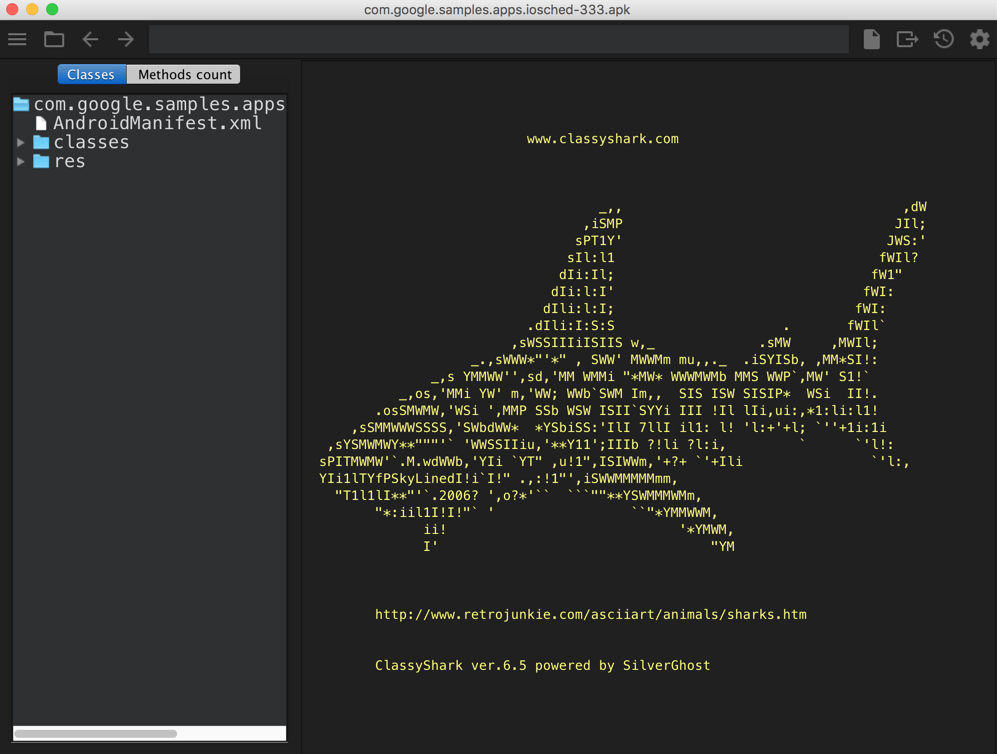
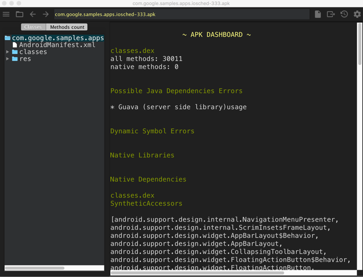
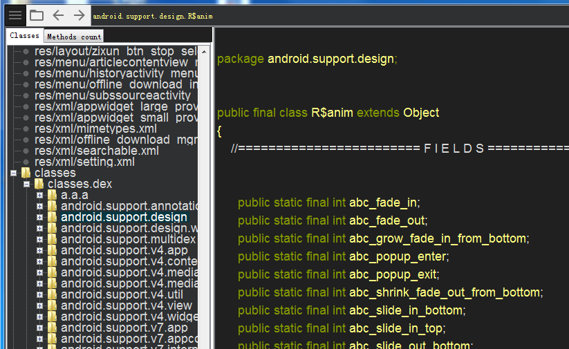
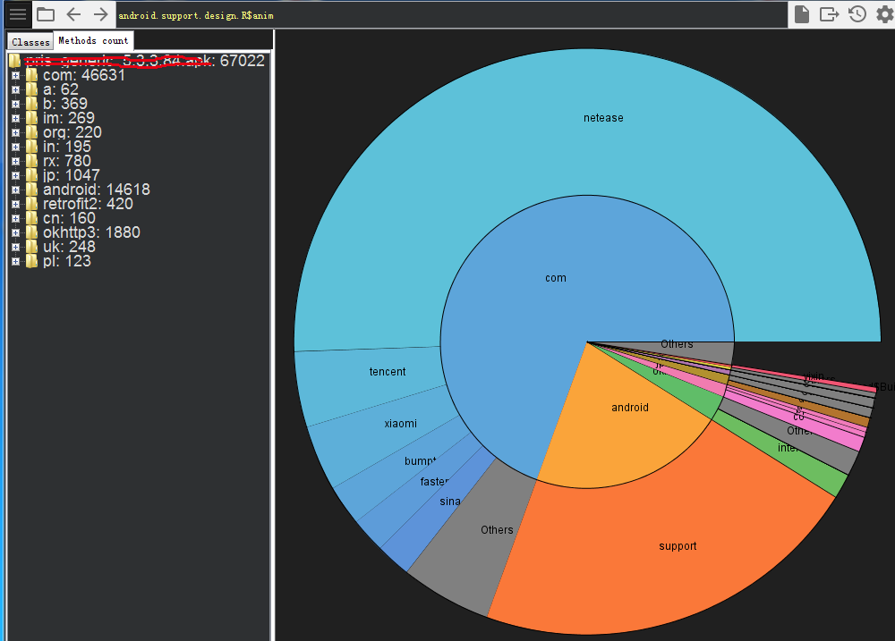
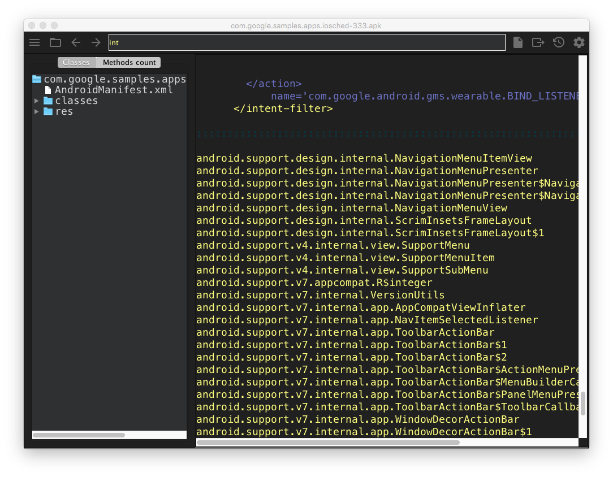
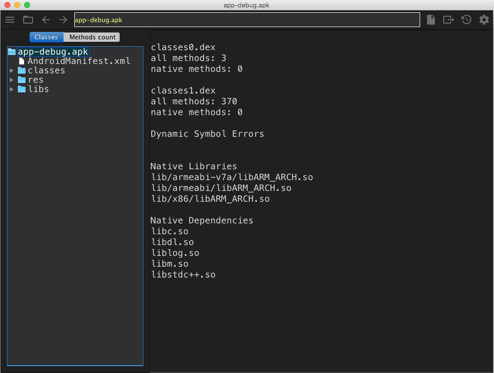

# ClassyShark

* 主页
  * [google/android-classyshark: Binary analysis of any Android/Java based app/APK/game](https://github.com/google/android-classyshark)
* 功能
  * 单独的二进制程序
    * 用来浏览和查看apk信息
      * 类的接口和成员
      * dex个数和依赖
    * 支持输入格式
      * 库
        * `dex`
        * `aar`
        * `so`
      * 可执行文件
        * `apk`
        * `jar`
        * `class`
      * 安卓二进制XML
        * `AndroidManifest`
        * 资源文件
        * 布局文件
* 截图
  * 
  * 
  * 
  * 
  * 
  * 
