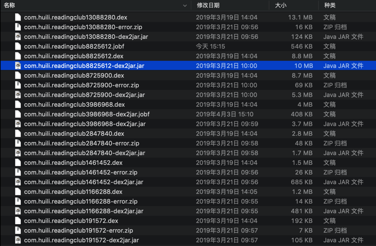

# jar转java

此处主要讨论`jar`转`java`的反编译器：

* 输入：`dex`文件
  * 前面一步从`dex`转换得到的`jar`文件
    * 举例
      * `com.huili.readingclub8825612-dex2jar.jar`
        * 
* 反编译
  * 选择合适的反编译器
  * 从`jar`反编译出`java`代码
* 输出：`java`源代码
