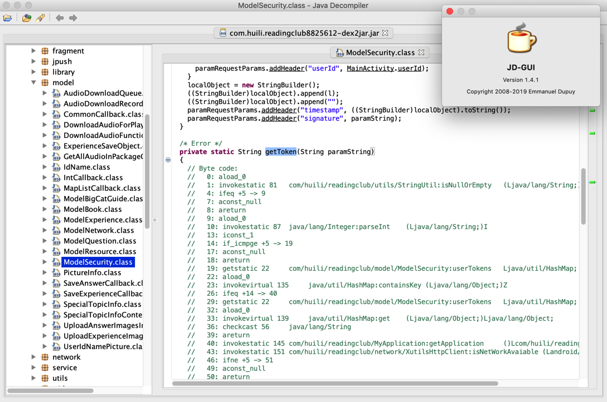
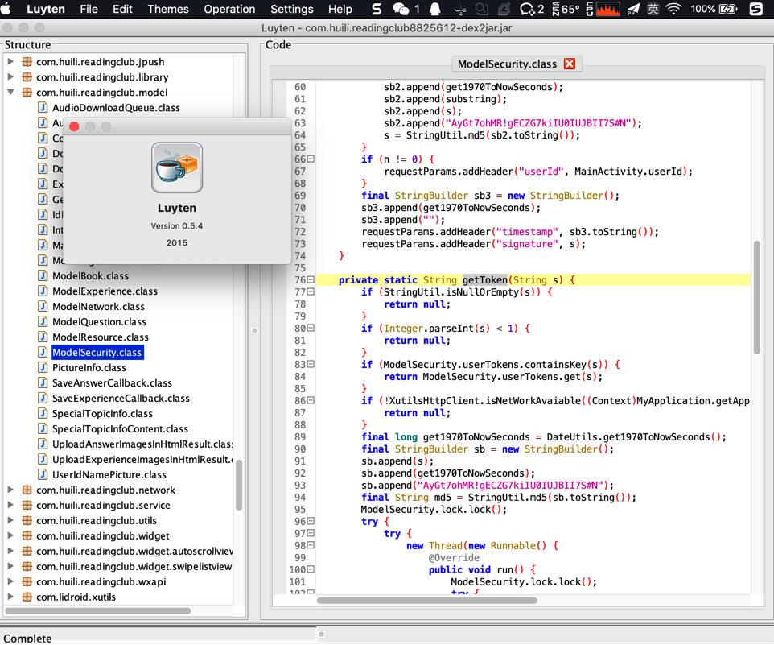
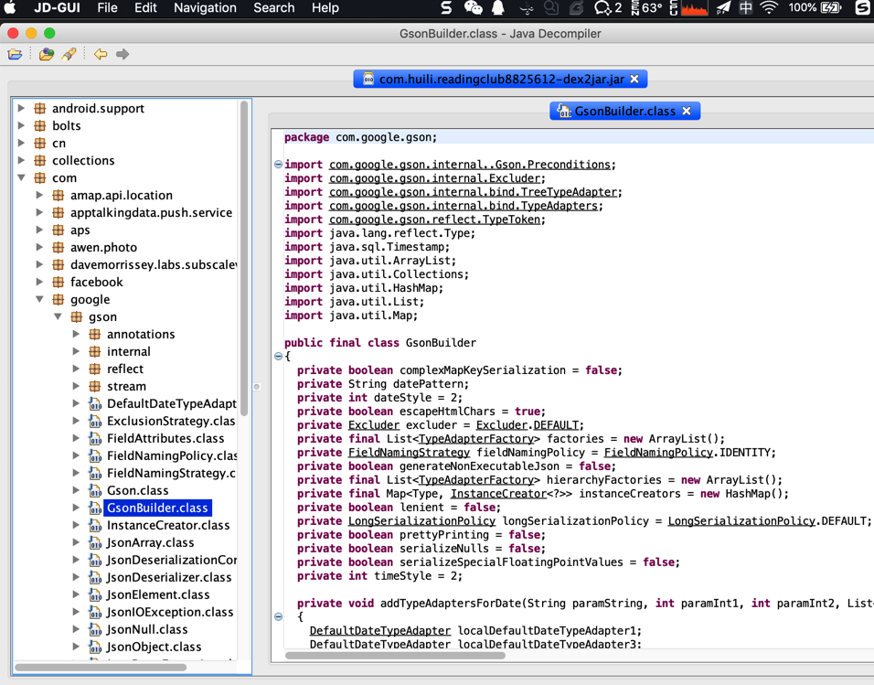
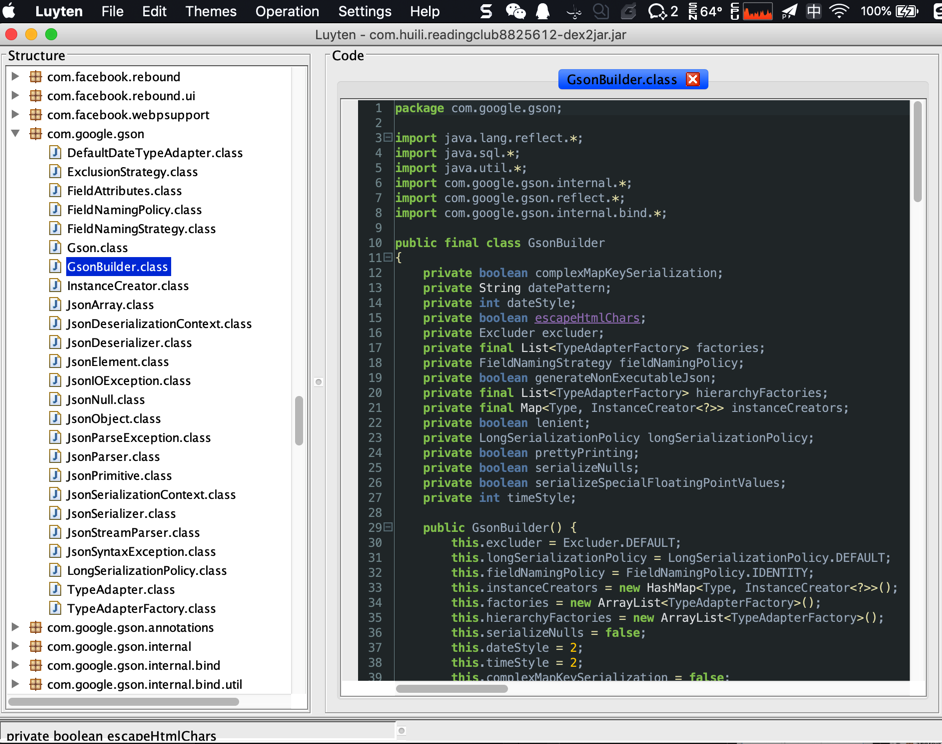
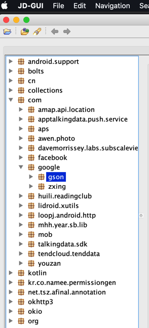
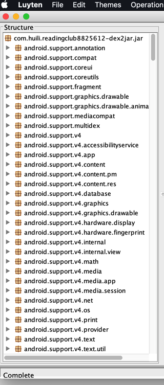
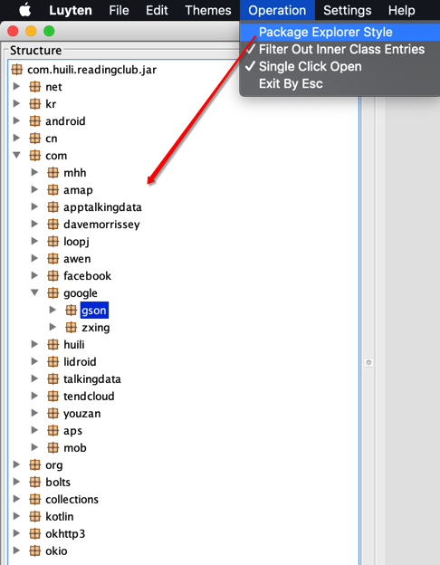

# 对比结果

## Luyten vs Procyon

从jar包导出代码：

* Luyten
  * 带GUI图形界面：可直接查看代码
  * 也可用来Save all导出全部代码
    * 但是速度比较慢
      * 当代码很大时：几十分钟还没导出完毕
* Procyon
  * 不带界面，只是一个jar包：
    * `procyon-decompiler-0.5.34.jar`
  * 可直接用来从你的jar包导出源码
    * 当代码很大时：速度很快，1分钟左右即可搞定

## `JD-GUI` vs (基于`Procyon`的)`Luyten`

| 对比项 | JD-GUI | Luyten |
| ----- | ------ | ------ |
| 流行程度 | 比较广->大家用的比较多 | 一般->相对使用的人不是很多 |
| jar转java的准确率 | 高  ->jd-gui代码转换出错Error   | 很高 ->Luyten中可正确解析显示源码：  |
| 显示：整体UI界面和代码高亮 | 比较简单和朴素->不够炫酷和好看    | 好看，而且支持多种语法高亮效果 -> 更方便看代码    |
| 显示：包/类的显示结构 | 以目录的树状结构显示的 -> 层次比较清晰    | （默认）平铺直叙，直接显示的 ->层次结构不够清晰      后记： 后来发现，把默认勾选的选项 `Operation`-> `Package Explorer Style` 取消勾选，也可以按照树状显示类和包名了：  |

## `JD-GUI` vs `CFR` vs `Procyon` vs `Jadx` 对比总结

下面从整体总结和对比这几个反编译的反编译的效果：

| **java反编译器** | JD-GUI | CFR | Procyon | Jadx |
| ---------- | ------- | --- | ------- | ---- |
| **转换出错程度** | 比较多 | 少许 | 很少 | 极少 |
| **出错状态和相关信息** | 会显示：`/* Error */ // Byte code` | 输出转换期间出错的地方到文件：`summary.txt` | 会显示： `This method could not be decompiled.` `Original Bytecode` | |
| **转换出的代码的质量** | 不是很好，细节不够好 | 部分细节转换的略有瑕疵 但是还是可以看到基本代码逻辑的 | 完美转换细节 代码中字符数组定义等内容可以正确转换，但是逻辑不清晰 比如只是能转换出常量解析后的字符串值，而无法识别出是常量的引用 | 不仅转换完美无错，而且代码逻辑更准确和完整 代码中的常量的引用都能完美还原出来 代码中字符数组定义等内容可以完美转换 |
| **转换出的文件是否有标识** | 无 | 有，顶部有标识： Decompiled with CFR 0.141 并且还能列出具体出错的类： Could not load the following classes  | 有，顶部有标识： Decompiled by Procyon v0.5.34 | 无 |

所以最终结论就是：

* 以后**尽量用**`Jadx`
  * 直接用jadx打开未加固的apk
    * 即可查看和导出java源代码
  * 打开（用FDex2从加固了的apk导出的）dex文件
    * 查看和导出java源代码
* 其次**考虑用**`Procyon`（或基于Procyon的GUI工具`Luyten`）
  * 查看代码：用基于Procyon的`Luyten`去查看代码
  * 导出代码：用Procyon去从jar反编译转换出java源代码
