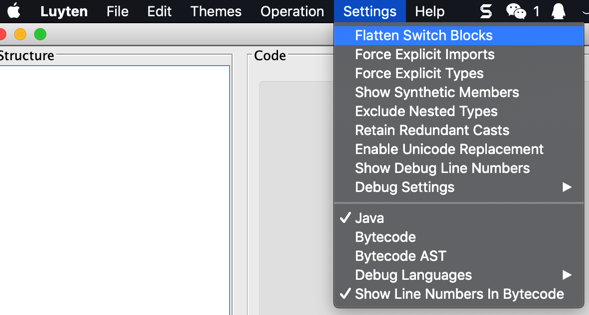

# Procyon

* `Procyon`
  * 是什么：反编译器
  * 作用：从`jar`中反编译导出`java`源码
  * 语法
    ```bash
    java -jar /path/to/your/procyon-decompiler-0.5.36.jar -jar jav_file.jar -o output_folder
    ```
    * 举例
      ```bash
      java -jar  Procyon/procyon-decompiler-0.5.36.jar -jar ../../dex_to_jar/com.ishowedu.child.peiyin8392664-dex2jar.jar -o com.ishowedu.child.peiyin8392664_java
      ```
  * bitbucket官网
    * [mstrobel / Procyon — Bitbucket](https://bitbucket.org/mstrobel/procyon)

## 用Procyon从jar导出java源码

下面介绍用Procyon作为命令行工具去导出一个jar包文件为java源代码的过程：

### 下载Procyon的jar包

比如 [procyon-decompiler-0.5.34.jar](https://bitbucket.org/mstrobel/procyon/downloads/procyon-decompiler-0.5.34.jar)

### 用procyon的jar包从你的jar包转换出java代码

语法：

```bash
java -jar /path/to/procyon-decompiler-0.5.34.jar -jar your_to_decompile.jar -o outputFolderName
```

举例：

```bash
java -jar  Procyon/procyon-decompiler-0.5.34.jar -jar com.huili.readingclub8825612-dex2jar.jar -o com.huili.readingclub8825612

java -jar  Procyon/procyon-decompiler-0.5.36.jar -jar ../../dex_to_jar/com.ishowedu.child.peiyin8392664-dex2jar.jar -o com.ishowedu.child.peiyin8392664_java
```

## 基于`Procyon`的`Luyten`中的菜单中参数是来自`procyon-decompiler`命令行的参数

从`procyon-decompiler`的help帮助信息是：

```bash
procyon-decompiler -?
Usage: <main class> [options] <type names or class/jar files>
  Options:
    -b, --bytecode-ast
       Output Bytecode AST instead of Java.
       Default: false
    -ci, --collapse-imports
       Collapse multiple imports from the same package into a single wildcard
       import.
       Default: false
    -cp, --constant-pool
       Includes the constant pool when displaying raw bytecode (unnecessary with
       -v).
       Default: false
    -dl, --debug-line-numbers
       For debugging, show Java line numbers as inline comments (implies -ln;
       requires -o).
       Default: false
        --disable-foreach
       Disable 'for each' loop transforms.
       Default: false
    -eml, --eager-method-loading
       Enable eager loading of method bodies (may speed up decompilation of
       larger archives).
       Default: false
    -ent, --exclude-nested
       Exclude nested types when decompiling their enclosing types.
       Default: false
    -ei, --explicit-imports
       [DEPRECATED] Explicit imports are now enabled by default.  This option
       will be removed in a future release.
       Default: false
    -eta, --explicit-type-arguments
       Always print type arguments to generic methods.
       Default: false
    -fsb, --flatten-switch-blocks
       Drop the braces statements around switch sections when possible.
       Default: false
    -fq, --force-qualified-references
       Force fully qualified type and member references in Java output.
       Default: false
    -?, --help
       Display this usage information and exit.
       Default: false
    -jar, --jar-file
       [DEPRECATED] Decompile all classes in the specified jar file (disables
       -ent and -s).
    -lc, --light
       Use a color scheme designed for consoles with light background colors.
       Default: false
    -lv, --local-variables
       Includes the local variable tables when displaying raw bytecode
       (unnecessary with -v).
       Default: false
    -ll, --log-level
       Set the level of log verbosity (0-3).  Level 0 disables logging.
       Default: 0
    -mv, --merge-variables
       Attempt to merge as many variables as possible.  This may lead to fewer
       declarations, but at the expense of inlining and useful naming.  This feature is
       experimental and may be removed or become the standard behavior in future releases.
       Default: false
    -o, --output-directory
       Write decompiled results to specified directory instead of the console.
    -r, --raw-bytecode
       Output Raw Bytecode instead of Java (to control the level of detail, see:
       -cp, -lv, -ta, -v).
       Default: false
    -ec, --retain-explicit-casts
       Do not remove redundant explicit casts.
       Default: false
    -ps, --retain-pointless-switches
       Do not lift the contents of switches having only a default label.
       Default: false
    -ss, --show-synthetic
       Show synthetic (compiler-generated) members.
       Default: false
    -sm, --simplify-member-references
       Simplify type-qualified member references in Java output [EXPERIMENTAL].
       Default: false
    -sl, --stretch-lines
       Stretch Java lines to match original line numbers (only in combination
       with -o) [EXPERIMENTAL].
       Default: false
    -ta, --type-attributes
       Includes type attributes when displaying raw bytecode (unnecessary with
       -v).
       Default: false
        --unicode
       Enable Unicode output (printable non-ASCII characters will not be
       escaped).
       Default: false
    -u, --unoptimized
       Show unoptimized code (only in combination with -b).
       Default: false
    -v, --verbose
       Includes more detailed output depending on the output language (currently
       only supported for raw bytecode).
       Default: false
        --version
       Display the decompiler version and exit.
       Default: false
    -ln, --with-line-numbers
       Include line numbers in raw bytecode mode; supports Java mode with -o
       only.
       Default: false
```

从这些支持的参数中，可以推断：

基于`Procyon`的`Luyten`中的菜单中的选项，都是对应着这些参数的。

比如：`Settings -> Flatten Switch Blocks`



对应着此处参数`--flatten-switch-blocks`：

```bash
    -fsb, --flatten-switch-blocks
       Drop the braces statements around switch sections when possible.
       Default: false
```

其他以此类推，都是一样的逻辑：把命令行工具的参数，用菜单选项的形式展示和支持出来了。
