# Luyten

* 主页
  * [deathmarine/Luyten: An Open Source Java Decompiler Gui for Procyon](https://github.com/deathmarine/Luyten)
* 功能
  * Java Decompiler Gui for Procyon
  * 基于Procyon的带图形界面的Java反编译器
* 界面
  * 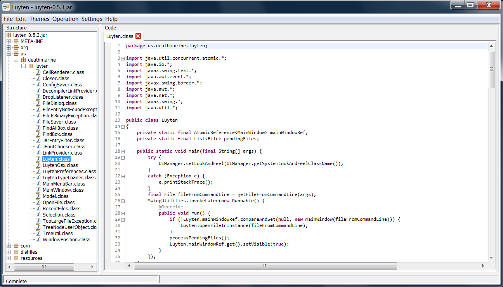
* 下载
  * [Release Luyten v0.5.4 · deathmarine/Luyten](https://github.com/deathmarine/Luyten/releases/latest)

## Luyten的语法高亮的不同主题的效果

* 默认：Default = Default-Alt
  * 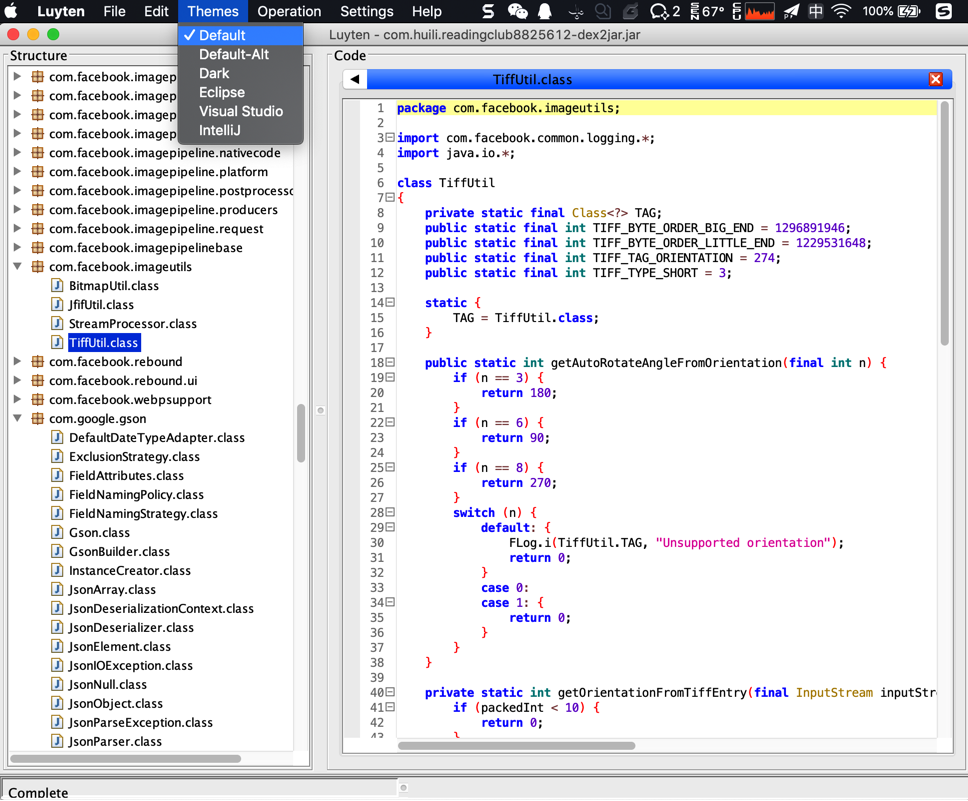
* Dark
  * 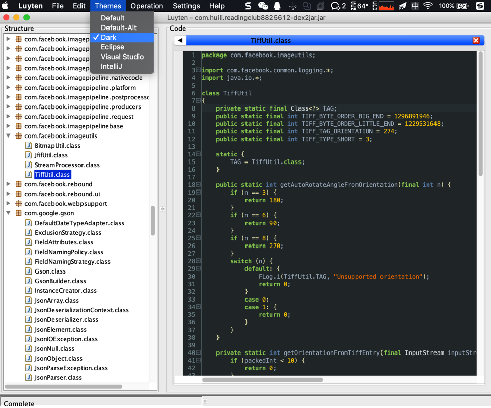
* Eclipse
  * 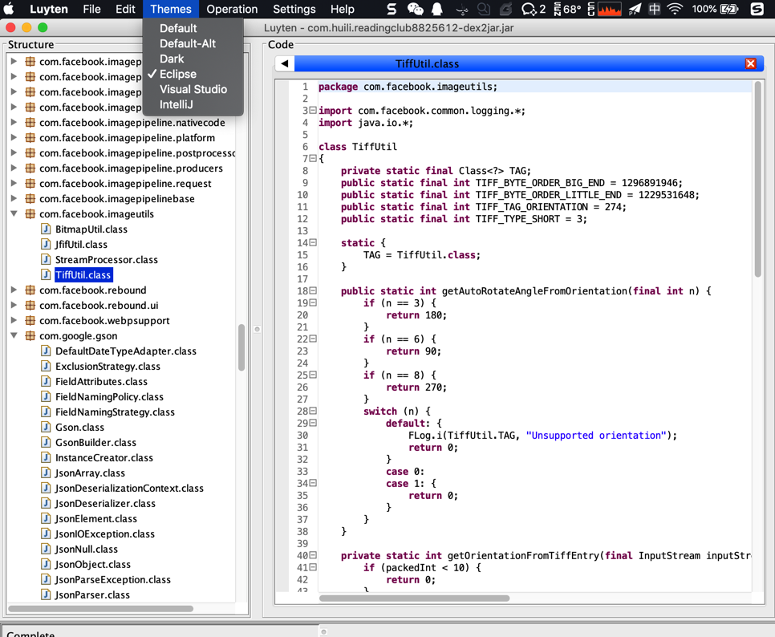
* Visual Studio
  * 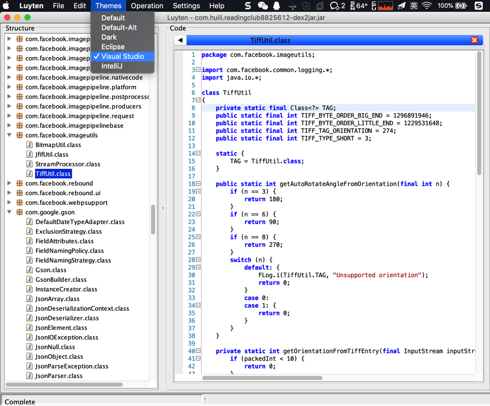
* IntelliJ
  * 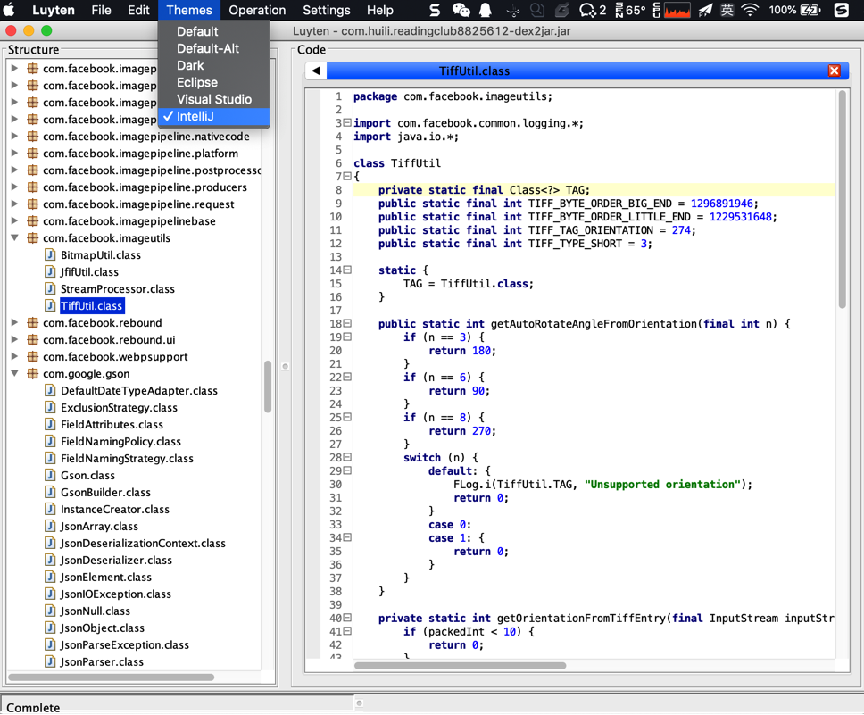

## 下载和使用Luyten去查看和导出java代码

去[Releases · deathmarine/Luyten](https://github.com/deathmarine/Luyten/releases/)下载最新版本，比如Mac版的：

[luyten-OSX-0.5.4.zip](https://github.com/deathmarine/Luyten/releases/download/v0.5.4/luyten-OSX-0.5.4.zip)

解压得到`Luyten.app`：

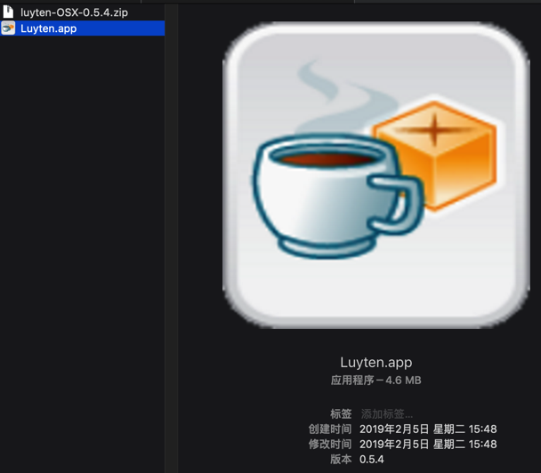

运行后：

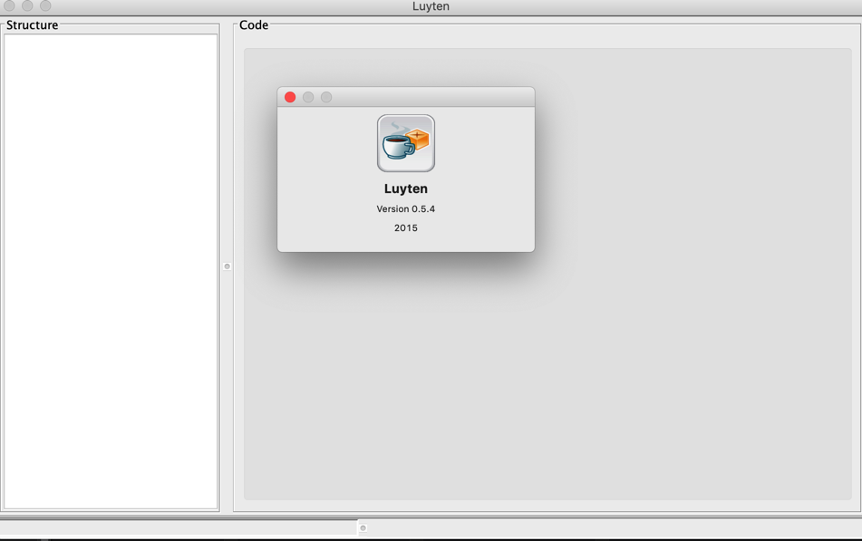

然后去把`jar`包拖进来即可看到代码：

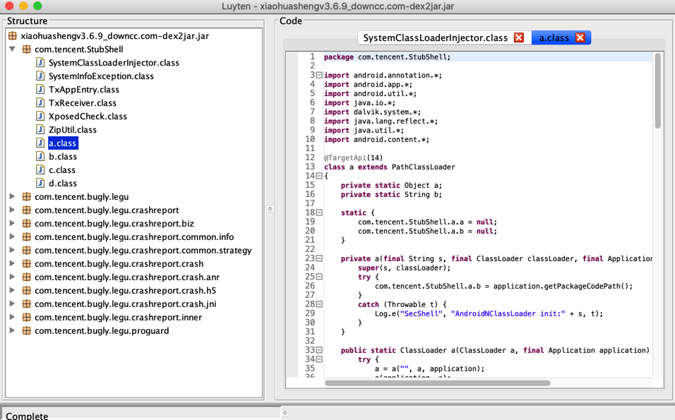

导出所有代码的步骤：

`File -> Save All -> decompiled-xxx.zip`

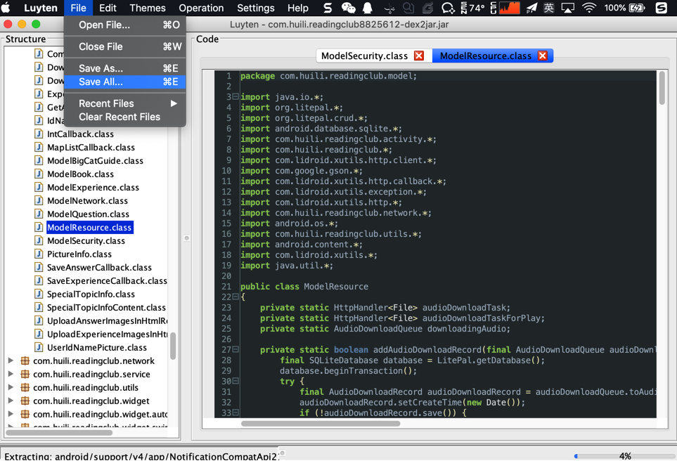

解压后，即可用VSCode等工具方便查看代码了。

之前`JD-GUI`、`CFR`等工具转换出错的代码，此处是可以正确解析的：

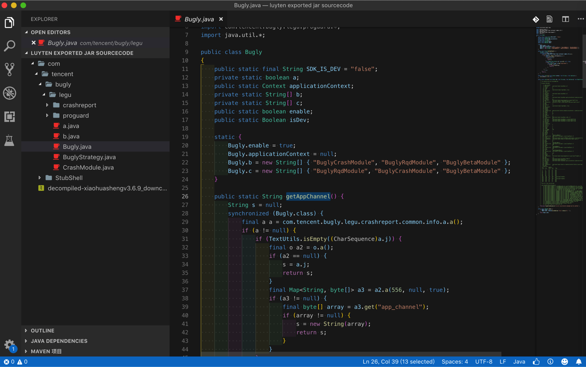

但是也还是有部分代码无法正确解析：

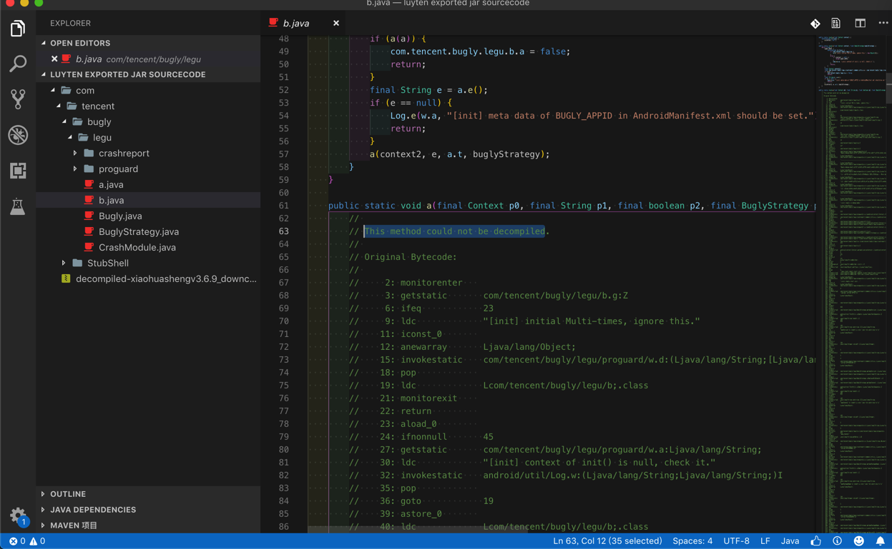
